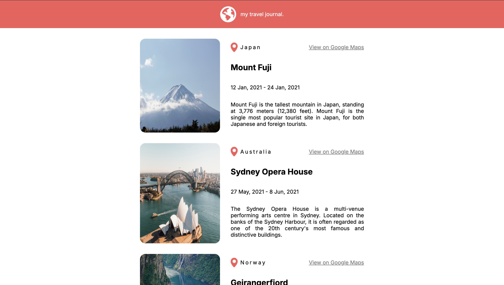

# Travel Journal

The project helps in understanding react props and basics of css and web design. The following picture shows the output of the project.



# Run the project
Install the dependencies and run the project
```
npm install
npm start
```